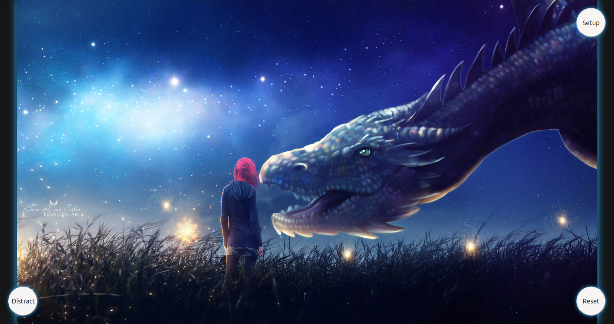
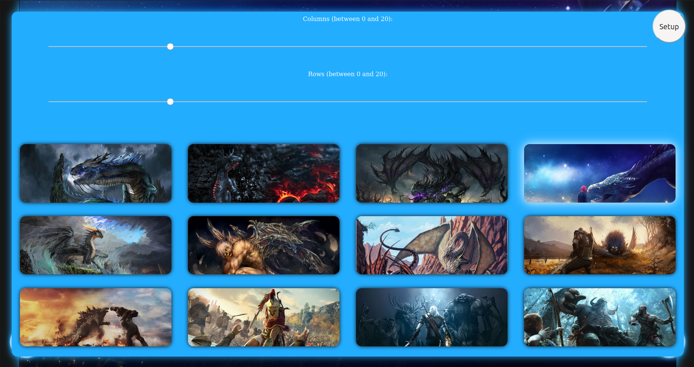

# Table of Contents
- [Table of Contents](#table-of-contents)
- [Math formatter](#math-formatter)
  - [Instalation](#instalation)
  - [Launch](#launch)
  - [Introduction](#introduction)
  - [General Info](#general-info)
    - [Frontend](#frontend)
      - [Desktop](#desktop)
      - [Mobile](#mobile)
  - [Code Example](#code-example)
  - [Technologies](#technologies)
- [Jigsaw Puzzle](#jigsaw-puzzle)
  - [Introduction](#introduction-1)
  - [General info](#general-info-1)
    - [Setup](#setup)
  - [Code Example](#code-example-1)
  - [Technologies](#technologies-1)
- [Portfolio](#portfolio)
  - [Introduction](#introduction-2)
  - [Launch](#launch-1)
  - [General Info](#general-info-2)
    - [Database](#database)
      - [Tables](#tables)
    - [Frontend](#frontend-1)
      - [Home](#home)
      - [Interests](#interests)
    - [Projects](#projects)
      - [Login](#login)
      - [Forum Threads](#forum-threads)
      - [Thread](#thread)
  - [Code Example](#code-example-2)
  - [Technologies](#technologies-2)


# Math formatter

## Instalation

1. Install chrome `sudo snap install chrome`
2. Instal flutter [INSTRUCTION](https://flutter.dev/docs/get-started/install)

## Launch

`flutter run --no-sound-null-safety -d chrome`

Browser shall open automatically. Port is being choosed randomly by `flutter`. Due to this fact `fav_math.html` to work requires to set `iframe` `src` to the flutter server. `fav_math` may be omitted, main functionality `math formatter is displayed ad localhost:port.


## Introduction
Math formatter is a simple `flutter` web application that allows to write `LaTeX` text in website and dynamically render formatted math symbols and marks.

## General Info
`fav_math.html` containing `iframe` with reference to `flutter web application`.

`[Warning]` `flutter web app` must be available under `localhost:port`.

### Frontend
#### Desktop


#### Mobile


## Code Example
```dart
@override
  Widget build(BuildContext context) {
    bool isScreenWide =
      MediaQuery.of(context).size.width >= kMinWidthOfLargeScreen;
    return Flex(
      direction: isScreenWide ? Axis.horizontal : Axis.vertical,
      children: < Widget > [
        Expanded(
          flex: 1,
          child: Padding(
            padding: EdgeInsets.symmetric(horizontal: 8, vertical: 16),
            child: Container(
              height: 100.0,
              child: TextField(
                controller: myController,
                keyboardType: TextInputType.multiline,
                maxLines: null,
                decoration: InputDecoration(
                  border: OutlineInputBorder(),
                  labelText: 'Latex',
                ),
              ),
            ),
          ),
        ),
        Expanded(
          flex: 1,
          child: Padding(
            padding: EdgeInsets.symmetric(horizontal: 8, vertical: 16),
            child: beautify('${myController.text}'),
          ),
        ),
      ],
    );
  }
}
```

## Technologies
- Flutter
- Dart
- CaTeX
- KaTeX
- MathJax
- CSS
- HTML
- Javascript

# Jigsaw Puzzle

https://user-images.githubusercontent.com/43937286/119197549-3a380300-ba88-11eb-8abe-04a43ad98e4f.mp4


## Introduction

Simple Jigsaw Puzzle web game implemented mostly in Javascript.



## General info

Puzzle game, which relies on:

1. splitting image into `n` x `m` lattice
2. shuffle created tiles
3. bring the boards back to their original position by swapping `blank` tile with its neighbours


Game is always solveable, inversions quantityand board width determines game solvability. 

1. If the width is odd, then every solvable state has an even number of inversions. 
2. If the width is even, then every solvable state has 
    1. an even number of inversions if the blank is on an odd numbered row counting from the bottom;
    2. an odd number of inversions if the blank is on an even numbered row counting from the bottom;

### Setup

Puzzle board size and background image may be choosed by user.




## Code Example
```javascript

/**
 * Hover Listener when hovering image next to blurred one then image is overlayed
 * with white semi-transparent white layer. After taking cursor out of adjacent
 * tile then redrawing image.
 */
function onTileHover(e) {
  let tile = getCurrentTile(e);
  if (lastDisplayedTile !== null) {
    drawTile(lastDisplayedTile);
  }
  if (tile !== null && tile.TILE_TYPE === TILE_TYPE.ADJACENT) {
    boardContext.globalAlpha = 0.15;
    boardContext.fillStyle = '#ffffff';
    boardContext.fillRect(tile.x * tileWidth, tile.y * tileHeight, tileWidth, tileHeight);
    boardContext.strokeRect(tile.x * tileWidth, tile.y * tileHeight, tileWidth, tileHeight);
    lastDisplayedTile = tile;
  } else {
    lastDisplayedTile = null;
  }
}

```

## Technologies
- JAVASCRIPT
- CSS
- HTML


# Portfolio

## Introduction

Fully responsive website presents my computer science portfolio. Specification can be found in `www-l1.pdf`
and `www-l3.pdf` included into this repository.

Main functionalities/ pages available in project:

- home page ( stores some information about my interests, skills and way of contact )
- projects page ( dedicated to preview all my best projects that I had struggled with )
- login/ registration system ( sign up gives access to forum, threads are my projects where users can discuss them via
  comments )
- forum/ threads page ( after logging user can comment all my projects, this option need a connection with a database. I
  had used MySQL with lampp ( apache ) )

Pages are enriched with javascript, stylesheets had been written using compass and sass.

## Launch

Website is available under this link [popsite](https://sqoshi.github.io).

Unfortunately, GitHub pages does not handle MySQL database so PHP code is `useless` (version limited to CSS, SASS, HTML
and JAVASCRIPT).

If you want to use full version, you will need to create database and run php server. Under directory `resources/sql`
you may find a source `sql` code to recreate this database.

I recommend `lampp` to run php server with `mysql` and `apache2`.

## General Info

Website had been designed in accordance with rule `mobile first`.

### Database

#### Tables


### Frontend

#### Home


#### Interests


### Projects

`mobile version`


#### Login 


#### Forum Threads


#### Thread


## Code Example

``` html
<div class="project-tile">
     <div class="project-object">
      <div class="project-container" onclick="toggle_project_info(this)">
       
       <div class="project-object-img-overlay">
       </div>
       <p class="project-object-name">
        GPA calculator
       </p>
      </div>
     </div>
     <div class="project-info">
      <div class="text">
       <embed class="readme" src="resources/readmes/gpa.html"/>
      </div>
     </div>
    </div>
```

`views counter`

```php

<?php
require_once "config.php";
if (!empty($_SERVER['HTTP_CLIENT_IP'])) {
    $ip = $_SERVER['HTTP_CLIENT_IP'];
} elseif (!empty($_SERVER['HTTP_X_FORWARDED_FOR'])) {
    $ip = $_SERVER['HTTP_X_FORWARDED_FOR'];
} else {
    $ip = $_SERVER['REMOTE_ADDR'];
}


$query = "SELECT * FROM `visits` WHERE ip = ? AND last_visit < NOW()";
$stmt = $link->prepare($query);
$stmt->bind_param('s', $ip);
$stmt->execute();

$result = $stmt->get_result();
if ($result->num_rows == 0) {
    $sql = "INSERT INTO `visits` (ip, last_visit) VALUES (?, NOW())";
    if ($stmt = mysqli_prepare($link, $sql)) {
        mysqli_stmt_bind_param($stmt, "s", $ip);
        mysqli_stmt_execute($stmt);
        mysqli_stmt_close($stmt);
    }
}
$stmt->free_result();
$stmt->close();


$query = "SELECT * FROM `visits`";
$stmt = $link->prepare($query);
$stmt->execute();
$result = $stmt->get_result();
echo "<div style='width:100%;display: flex;justify-content: center;'><p>Views: $result->num_rows </p></div>";
$stmt->free_result();
$stmt->close();


$link->close();

```

## Technologies
- PHP
- SASS
- COMPASS
- Javascript
- MySQL
- CSS
- HTML