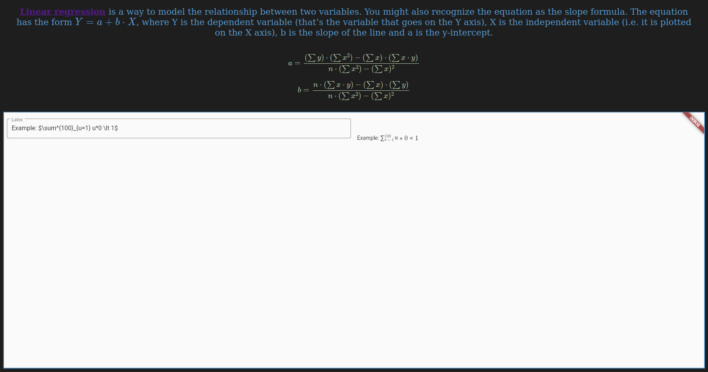

# Math formatter
## Table of Contents
- [Math formatter](#math-formatter)
  - [Table of Contents](#table-of-contents)
  - [Instalation](#instalation)
  - [Launch](#launch)
  - [Introduction](#introduction)
  - [General Info](#general-info)
    - [Frontend](#frontend)
      - [Desktop](#desktop)
      - [Mobile](#mobile)
  - [Code Example](#code-example)
  - [Technologies](#technologies)

## Instalation

1. Install chrome `sudo snap install chrome`
2. Instal flutter [INSTRUCTION](https://flutter.dev/docs/get-started/install)

## Launch

`flutter run --no-sound-null-safety -d chrome`

Browser shall open automatically. Port is being choosed randomly by `flutter`. Due to this fact `fav_math.html` to work requires to set `iframe` `src` to the flutter server. `fav_math` may be omitted, main functionality `math formatter is displayed ad localhost:port.


## Introduction
Math formatter is a simple `flutter` web application that allows to write `LaTeX` text in website and dynamically render formatted math symbols and marks.

## General Info
`fav_math.html` containing `iframe` with reference to `flutter web application`.

`[Warning]` `flutter web app` must be available under `localhost:port`.

### Frontend
#### Desktop


#### Mobile


## Code Example
```dart
@override
  Widget build(BuildContext context) {
    bool isScreenWide =
      MediaQuery.of(context).size.width >= kMinWidthOfLargeScreen;
    return Flex(
      direction: isScreenWide ? Axis.horizontal : Axis.vertical,
      children: < Widget > [
        Expanded(
          flex: 1,
          child: Padding(
            padding: EdgeInsets.symmetric(horizontal: 8, vertical: 16),
            child: Container(
              height: 100.0,
              child: TextField(
                controller: myController,
                keyboardType: TextInputType.multiline,
                maxLines: null,
                decoration: InputDecoration(
                  border: OutlineInputBorder(),
                  labelText: 'Latex',
                ),
              ),
            ),
          ),
        ),
        Expanded(
          flex: 1,
          child: Padding(
            padding: EdgeInsets.symmetric(horizontal: 8, vertical: 16),
            child: beautify('${myController.text}'),
          ),
        ),
      ],
    );
  }
}
```

## Technologies
- Flutter
- Dart
- CaTeX
- KaTeX
- MathJax
- CSS
- HTML
- Javascript