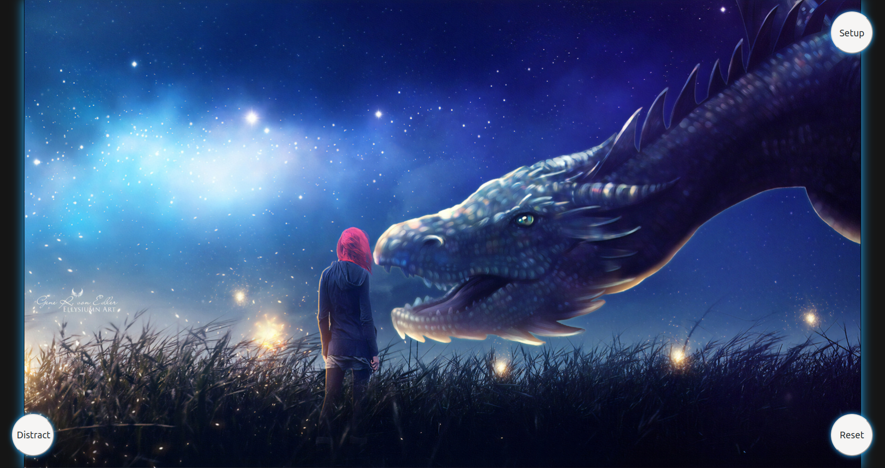
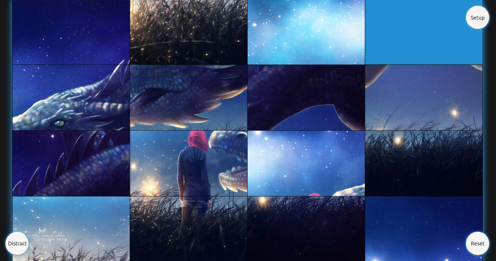
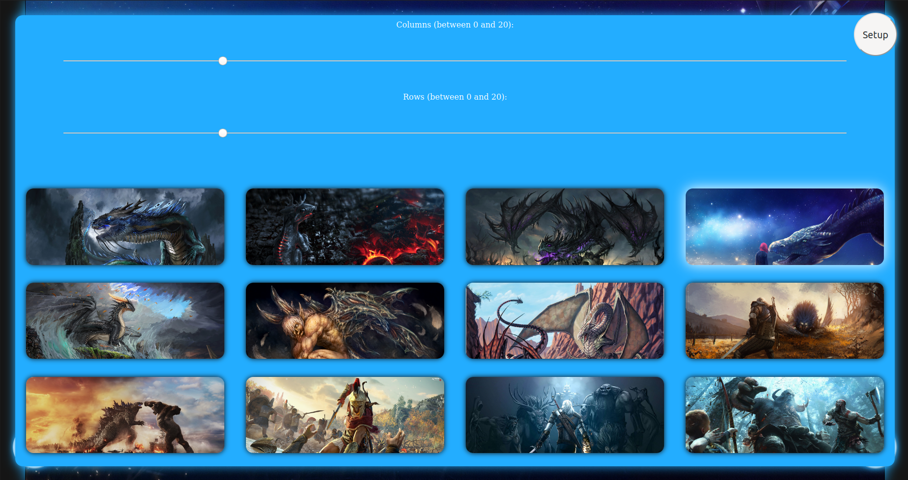

# Jigsaw Puzzle

https://user-images.githubusercontent.com/43937286/119197549-3a380300-ba88-11eb-8abe-04a43ad98e4f.mp4


## Table of contents

- [Jigsaw Puzzle](#jigsaw-puzzle)
  - [Table of contents](#table-of-contents)
  - [Introduction](#introduction)
  - [General info](#general-info)
    - [Setup](#setup)
  - [Code Example](#code-example)
  - [Technologies](#technologies)

## Introduction

Simple Jigsaw Puzzle web game implemented mostly in Javascript.



## General info

Puzzle game, which relies on:

1. splitting image into `n` x `m` lattice
2. shuffle created tiles
3. bring the boards back to their original position by swapping `blank` tile with its neighbours




Game is always solveable, inversions quantityand board width determines game solvability. 

1. If the width is odd, then every solvable state has an even number of inversions. 
2. If the width is even, then every solvable state has 
    1. an even number of inversions if the blank is on an odd numbered row counting from the bottom;
    2. an odd number of inversions if the blank is on an even numbered row counting from the bottom;

### Setup

Puzzle board size and background image may be choosed by user.




## Code Example
```javascript

/**
 * Hover Listener when hovering image next to blurred one then image is overlayed
 * with white semi-transparent white layer. After taking cursor out of adjacent
 * tile then redrawing image.
 */
function onTileHover(e) {
  let tile = getCurrentTile(e);
  if (lastDisplayedTile !== null) {
    drawTile(lastDisplayedTile);
  }
  if (tile !== null && tile.TILE_TYPE === TILE_TYPE.ADJACENT) {
    boardContext.globalAlpha = 0.15;
    boardContext.fillStyle = '#ffffff';
    boardContext.fillRect(tile.x * tileWidth, tile.y * tileHeight, tileWidth, tileHeight);
    boardContext.strokeRect(tile.x * tileWidth, tile.y * tileHeight, tileWidth, tileHeight);
    lastDisplayedTile = tile;
  } else {
    lastDisplayedTile = null;
  }
}

```

## Technologies
- JAVASCRIPT
- CSS
- HTML

